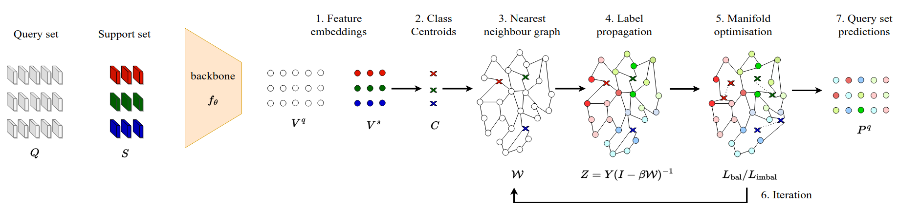

# AM/α-AM

This repo covers the implementation of the following paper: 

**"Adaptive manifold for imbalanced transductive few-shot learning (WACV 2024)"** [Pre-print](https://arxiv.org/abs/2304.14281), [Paper](https://openaccess.thecvf.com/content/ICCV2021/html/Lazarou_Iterative_Label_Cleaning_for_Transductive_and_Semi-Supervised_Few-Shot_Learning_ICCV_2021_paper.html)
<p align='center'>
  
</p>

## Abstract

Transductive few-shot learning algorithms have showed substantially superior performance over their inductive counterparts by leveraging the unlabeled queries at inference. However, the vast majority of transductive methods are evaluated on perfectly class-balanced benchmarks. It has been shown that they undergo remarkable drop in performance under a more realistic, imbalanced setting.

To this end, we propose a novel algorithm to address imbalanced transductive few-shot learning, named Adaptive Manifold. Our algorithm exploits the underlying manifold of the labeled examples and unlabeled queries by using manifold similarity to predict the class probability distribution of every query. It is parameterized by one centroid per class and a set of manifold parameters that determine the manifold. All parameters are optimized by minimizing a loss function that can be tuned towards class-balanced or imbalanced distributions. The manifold similarity shows substantial improvement over Euclidean distance, especially in the 1-shot setting.

Our algorithm outperforms all other state of the art methods in three benchmark datasets, namely miniImageNet, tieredImageNet and CUB, and two different backbones, namely ResNet-18 and WideResNet-28-10. In certain cases, our algorithm outperforms the previous state of the art by as much as $4.2\%$.

If you find this repo useful for your research, please consider citing the paper
```
@inproceedings{AMWACV2024,
  title={Iterative label cleaning for transductive and semi-supervised few-shot learning},
  author={Lazarou, Michalis and Stathaki, Tania and Avrithis, Yannis},
  booktitle={Proceedings of the IEEE/CVF Winter Conference on Applications of Computer Vision},
  year={2024}
}
```

## 1. Getting started

**This code is based on the codebase of the NeuRIPS 2022 paper "Realistic evaluation of transductive few-shot learning". The following instructions are the same as the aforementioned paper.**

### 1.1 Quick installation (recommended) (Download datasets and models)
To download datasets and pre-trained models (checkpoints), follow instructions 1.1.1 to 1.1.2 of NeurIPS 2020 paper "TIM: Transductive Information Maximization" public implementation (https://github.com/mboudiaf/TIM)

#### 1.1.1 Place datasets
Make sure to place the downloaded datasets (data/ folder) at the root of the directory.

#### 1.1.2 Place models
Make sure to place the downloaded pre-trained models (checkpoints/ folder) at the root of the directory.

### 1.2 Manual installation
Follow instruction 1.2 of NeurIPS 2020 paper "TIM: Transductive Information Maximization" public implementation (https://github.com/mboudiaf/TIM) if facing issues with previous steps. Make sure to place data/ and checkpoints/ folders at the root of the directory.

### 2. Requirements
To install requirements:
```bash
conda create --name <env> --file requirements.txt
```
Where \<env> is the name of your environment

## 3. Reproducing the main results

Before anything, activate the environment:
```python
source activate <env>
```

To reproduce the imbalanced results from Tables 2. and 3. in the paper, from the src/ directory execute this python command. Use the --plc for plc pre-processing
Please in the config/ directory for both balanced and dirichlet directories in the base_config directory in every base_config.yaml file make sure you set up the correct path whereveris required.
```python
python main.py --backbone <resnet18/wideres> --config_path <path/to/config> --dataset <mini/cub/tiered> --method <method_name> --balancing dirichlet --phi mus+G+Wb --plc
```

To reproduce the balanced results from Tables 4. and 5. in the paper, from the src/ directory execute this python command. Use the --plc for plc pre-processing
```python
python main.py --backbone <resnet18/wideres> --config_path <path/to/config> --dataset <mini/cub/tiered> --method <method_name> --balancing balanced --phi mus+G+Wb --plc
```

## Contacts
For any questions, please contact:

Michalis Lazarou (ml6414@ic.ac.uk)  
Yannis Avrithis (yannis@avrithis.net)  
Tania Stathaki (t.stathaki@imperial.ac.uk)  


## Acknowlegements
[α-ΤΙΜ](https://github.com/oveilleux/Realistic_Transductive_Few_Shot)

[ΤΙΜ](https://github.com/mboudiaf/TIM)

[iLPC](https://github.com/MichalisLazarou/iLPC)

[S2M2_fewshot](https://github.com/nupurkmr9/S2M2_fewshot)


